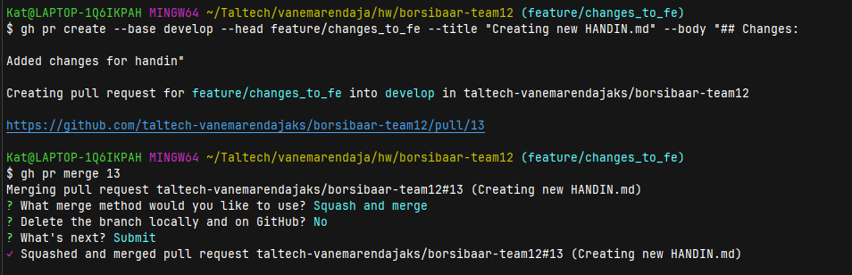
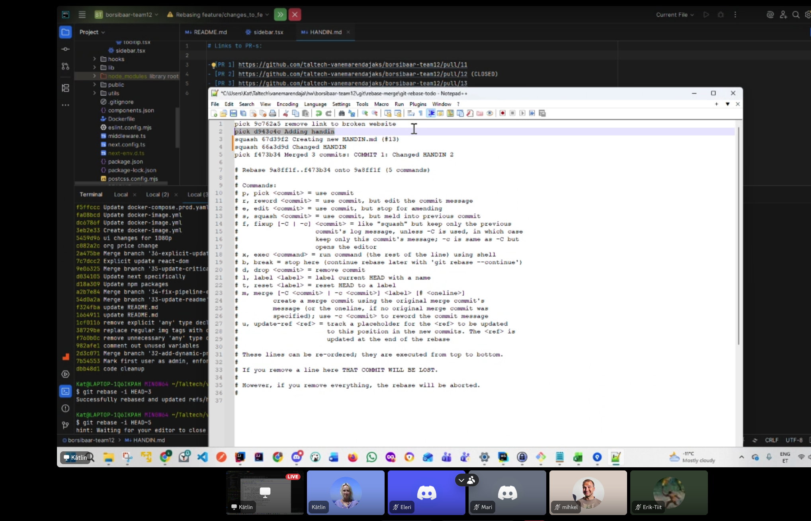

# HANDIN for Git Collaboration Exercise

## Links to PR-s:
- [PR 1] https://github.com/taltech-vanemarendajaks/borsibaar-team12/pull/1
- [PR 2] https://github.com/taltech-vanemarendajaks/borsibaar-team12/pull/2
- [PR 3] https://github.com/taltech-vanemarendajaks/borsibaar-team12/pull/3 (CLOSED)
- [PR 4] https://github.com/taltech-vanemarendajaks/borsibaar-team12/pull/4 (CLOSED)
- [PR 5] https://github.com/taltech-vanemarendajaks/borsibaar-team12/pull/5
- [PR 6] https://github.com/taltech-vanemarendajaks/borsibaar-team12/pull/6
- [PR 7] https://github.com/taltech-vanemarendajaks/borsibaar-team12/pull/7
- [PR 8] https://github.com/taltech-vanemarendajaks/borsibaar-team12/pull/8 (CLOSED)
- [PR 9] https://github.com/taltech-vanemarendajaks/borsibaar-team12/pull/9 (CLOSED)
- [PR 10] https://github.com/taltech-vanemarendajaks/borsibaar-team12/pull/10
- [PR 11] https://github.com/taltech-vanemarendajaks/borsibaar-team12/pull/11
- [PR 12] https://github.com/taltech-vanemarendajaks/borsibaar-team12/pull/12 (CLOSED)
- [PR 13] https://github.com/taltech-vanemarendajaks/borsibaar-team12/pull/13
- [PR 14] https://github.com/taltech-vanemarendajaks/borsibaar-team12/pull/14 (CLOSED)
- [PR 15] https://github.com/taltech-vanemarendajaks/borsibaar-team12/pull/15
- [PR 16] https://github.com/taltech-vanemarendajaks/borsibaar-team12/pull/16
- [PR 17] https://github.com/taltech-vanemarendajaks/borsibaar-team12/pull/17
- [PR 18] https://github.com/taltech-vanemarendajaks/borsibaar-team12/pull/18
- [PR 19] https://github.com/taltech-vanemarendajaks/borsibaar-team12/pull/19

## What each team member worked on
Each teammember worked on creating feature branches, making commits and pull requests.

We collaborated on .md files, intentionally created conflicts, and resolved them. We also experimented with different merge strategies using the VS Code terminal.

## Explanation of the conflict you had and how it was resolved

During our collaboration, we encountered several merge conflicts while working on the same TEAM.md file. 
For instance, two team members edited the same section of a file simultaneously, leading to a conflict when merging their changes.

## Strategies used to merge:
Made in terminal, as well as in Github web interface:

* a regular merge commit - just to commit sth
* a squash merge - to take some commits together into one
* a rebase-based merge - to keep history straight line

Just to see how they differ in the commit history, and to practice using different methods.

